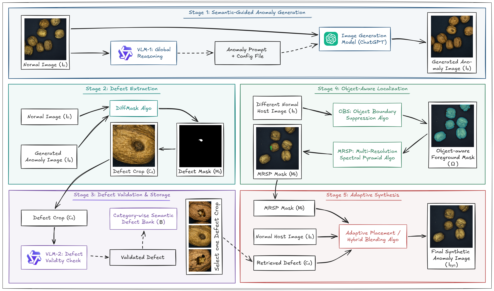
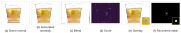

# FLASH

**A "generate once, synthesize many" framework for reference-free synthetic anomaly generation.**

[](LICENSE)
[](pyproject.toml)
[](https://www.mvtec.com/research-teaching/datasets/mvtec-ad-2)

<p align="center">
  
</p>

This repository contains the reference implementation of *FLASH: A "Generate Once, Synthesize
Many" Framework for Synthetic Anomaly Generation in Industrial Anomaly Detection*.

## Abstract

Synthetic anomaly generation helps expand industrial anomaly datasets when real defects are
scarce or unavailable. Existing approaches lie at two extremes: procedural approaches are fast but
struggle to represent complex anomalies, while generative approaches produce diverse defects but
require costly per-sample generation. We present FLASH, a framework that decouples defect
generation from anomaly synthesis under a "generate once, synthesize many" paradigm. Given only
normal images, FLASH uses Vision Language Model (VLM) guidance and an image-generation model to
produce a small set of defect images, from which it extracts, validates, and banks reusable defect
patches. For synthesis of anomalous images, Object Boundary Suppression (OBS) first identifies the
probable foreground object-aware region of the host image, while Multi-Resolution Spectral Pyramid
(MRSP) noise generates diverse, size-controllable masks that determine the defect location and
spatial extent. It then composes a large and diverse synthetic anomalous image set by localizing
the defect region, sampling size-controllable placement masks and seamlessly blending retrieved
defects onto new defect-free images without further need for image generation. Experiments on the
MVTec AD 2 dataset show that FLASH-generated anomalies nearly close the calibration gap on real
defects, reaching 78.1 % image-level F1 against an 83.6 % real-anomaly upper bound and providing
the most consistent calibration transfer across detectors among procedural and generative
alternatives. Moreover, FLASH synthesizes anomalies more than 11.95x faster than per-sample
generative approaches.

## Why decouple generation from synthesis

Production lines yield almost exclusively defect-free products, so real anomalies are rare,
diverse, and expensive to collect and annotate. Synthetic anomaly generation is the practical
alternative, and existing work sits at two extremes.

Procedural methods are fast. They perturb a normal image with noise masks or feature-space
transforms, cost almost nothing per sample, and scale to any corpus size. What they cannot do is
represent a defect that depends on the material and the scene, because nothing in the method knows
what the object is made of or what can plausibly go wrong with it.

Generative methods are the opposite. A diffusion or style-transfer model conditioned on the
category produces defects that sit correctly in the domain, but every single output image costs a
full generative inference. The cost grows linearly with the size of the set you want, which is
precisely the wrong scaling for the use case, since the reason to synthesise at all is that you
need many samples.

FLASH sits between them, and it gets there by separating two things that both families treat as a
single operation:

* **What the defect is.** A defect is generated once, extracted, validated, and stored in a
  category-wise bank as a reusable crop with its own recovered mask. This is the only part that
  touches a generative model, and it runs a fixed number of times per category, independent of how
  many synthetic images you eventually want.
* **Where and how large it appears.** Placement is a separate, purely procedural stage. A
  banked defect is localized on a fresh normal host, scaled, oriented, harmonized and blended.
  No model is loaded, and the per-image cost is that of ordinary image operations.

Once the two are separated, the generative cost stops scaling with the corpus. A bank of *k*
defects composes an arbitrarily large anomaly set, with each entry reusable across different
hosts, locations, orientations and spatial extents. FLASH keeps the domain-consistent defect
appearance that only a generative model can supply, and the per-sample economics of a procedural
method.

The inputs are normal images and nothing else. No real defect is ever referenced, and every
synthetic anomaly ships with a pixel-accurate mask.

The target application is **decision-threshold calibration without real defects**. Anomaly
detection benchmarks usually calibrate their decision threshold on real test anomalies, which is
exactly the assumption that fails in a zero-shot or unsupervised deployment. FLASH supplies the
calibration set instead.

### The mask is recovered, not prescribed

Most inpainting pipelines are mask-first: fix a mask, then ask a model to fill it. The generated
defect then under-fills or over-fills the prescribed region and the label no longer agrees with
the image.

FLASH inverts this. The generator re-renders the whole frame with a defect in it, and the mask is
recovered from what actually changed between the normal image and the generated one. DiffMask
treats that difference as a signal-recovery problem: alignment error, illumination drift and
re-render noise are nuisance, and the introduced defect is signal. The label cannot disagree with
the image, because it was measured from it.

<p align="center">
  
</p>

### Five stages, three modules

| Module | Stage | Operation |
|:--:|:--:|:--|
| **1** | 1 | A VLM reasons over a normal image to specify a plausible defect, its material context and its appearance, under hard constraints that preserve exposure, contrast, white balance, shadows and reflections. An image-generation model renders the anomaly image. |
| **2** | 2 | **DiffMask** registers the normal against the generated anomaly (similarity search, ECC refinement, feature-based fallback, dense-flow correction), matches them photometrically, fuses five residual cues into a difference score, and converts it to a mask through a local z-score, hysteresis thresholding and direction-matched completion. |
| **2** | 3 | Each recovered crop is judged by a second VLM pass and a substrate contrast gate. Accepted crops enter a category-wise semantic defect bank, indexed by category and defect type. |
| **3** | 4 | **OBS** estimates the foreground region of a fresh normal host from a CIELAB colour-distance cue OR'd with a local texture cue. **MRSP** builds a 1/f^alpha multi-resolution noise field and thresholds it at a quantile computed inside that region, so the target coverage is relative to the object rather than the frame. |
| **3** | 5 | The retrieved defect is scaled and oriented to the placement blob, harmonized against the host substrate in CIELAB, and composited by hybrid blending: feathered alpha for small placements, Poisson with a substrate collar for large ones. |

Stages 1 to 3 run **once per category**. Stages 4 and 5 run **per output image** and load no
model at all. That asymmetry is the efficiency claim.

Each module has a reference page in [`docs/modules/`](docs/modules), covering the algorithm, every
parameter and its value, the failure modes, and what to check before moving to the next module:
[Module 1](docs/modules/01_semantic_generation.md),
[Module 2](docs/modules/02_extraction_and_banking.md),
[Module 3](docs/modules/03_localisation_and_synthesis.md).

Stage 5 offers two placement modes. **original** places the defect at the MRSP blob centroid at
its source-relative scale. **adaptive** additionally aligns the defect with the blob's principal
orientation, scales it isotropically to the target coverage, anchors it at the deepest interior
point, and shrinks it until it satisfies the containment constraint.

<p align="center">
  
</p>

## Results

Evaluated on **MVTec AD 2**: high-resolution industrial scenes with varying illumination,
overlapping objects, transparent and reflective surfaces, and subtle foreign contamination.

The protocol holds the detector fixed and varies only the data used to fit its decision
threshold. The **real** setting fits the threshold on real test anomalies and is an oracle upper
bound, not a competing method. Each synthetic setting fits the threshold on held-out normals plus
its own generated anomalies, then evaluates on the same real test set. A synthetic source is good
to the extent that it approaches the oracle. Everything below is averaged over three seeds and,
where stated, over the eight categories.

The baselines are **Perlin**, the procedural reference-free standard, using DRAEM-style
Perlin-noise masks filled with Describable Textures Dataset patches, and **AnoStyler**, the
text-driven generative alternative, using CLIP-guided style transfer inside procedurally localized
foreground masks. Detectors run through Anomalib.

**Calibration quality.** FLASH reaches **78.1 % image-level F1 against an 83.6 % real-anomaly
oracle** on SuperADD, and across five detectors of very different type, parametric, coreset-based,
feature-mapping, training-free and distillation-based, it recovers **91 to 98 % of the oracle**.
It is the best synthetic source on **four of the five** detectors at the image level, and its
mean image F1 of 77.3 % sits well ahead of Perlin at 67.7 % and AnoStyler at 55.0 %. At the pixel
level it is best on three of the five and has the highest mean of the synthetic sources, 19.4 %
against 17.6 % for AnoStyler and 14.1 % for Perlin. On SuperADD it roughly doubles Perlin's pixel
F1, 38.4 % against 19.4 %.

The result FLASH is claiming is that consistency, not a win in every cell. Perlin edges ahead on
SuperADD image F1, but its much weaker pixel F1 shows that separating anomalous images globally
does not by itself give a spatially useful threshold. AnoStyler is stronger on PaDiM and
AnomalyDINO at the pixel level, and much weaker elsewhere. FLASH is the only source that transfers
across all five.

**Per category.** With SuperADD, FLASH has the best synthetic mean over the eight categories,
38.4 % pixel F1 against 37.0 % for AnoStyler and 19.4 % for Perlin, and comes closest to the
oracle on the textured-material categories: fabric at 69.1 % against a 78.4 % oracle, walnuts at
66.3 % against 71.9 %, fruit jelly at 55.6 % against 56.1 %. The largest single gain is rice,
51.9 % against a 58.8 % oracle, where Perlin manages only 6.2 %. The remaining categories are
complementary rather than uniform. AnoStyler wins on wallplugs, where the anomalies are primarily
geometric. Perlin wins on vial, a transparent back-lit setting. Sheet metal is hard for every
synthetic source under its dark-field illumination and specular structure. The can category is
degenerate, since the oracle itself scores near zero there and separates nothing, a failure also
reported by SuperADD.

**Cost.** This is where the decoupling pays. Synthesising one anomaly takes **586 ms** in FLASH
against **15.0 s** for per-sample generative synthesis, roughly **25x per image**, because the
per-image path loads no model. Counting the one-time defect generation that the procedural
baseline does not pay at all, a full category costs **112.8 s** against **1,348.1 s**, an
**11.95x speedup** and a **91.6 % reduction in generation time**. The gap widens with corpus size:
the generative cost of FLASH is fixed per category, so every additional synthetic image is
procedural.

Full per-arm tables, including the diagnostic arm that evaluates the fitted threshold back on the
synthetic set, are in
[`evaluation/results/combined_results_8_categories.txt`](evaluation/results/combined_results_8_categories.txt),
and the complete comparison tables are in the paper.

## Quickstart

```bash
git lfs install                        # the module archives are stored with Git LFS
git clone https://github.com/AbhayKumarDas/flash && cd flash
pip install -e .                       # generator only
pip install -r requirements-eval.txt   # optional, for the evaluation notebooks
```

Install Git LFS **before** cloning. Without it you get pointer files instead of the archives under
`data/`. On an existing clone, `git lfs pull` repairs it.

Then run the three notebooks in order. Each one is standalone and reads the previous module's
output from `data/`, so any module can be re-run on its own without repeating the ones before it.

| Step | Notebook | Input | Output |
|:--:|:--|:--|:--|
| 1 | [`01_semantic_generation.ipynb`](notebooks/01_semantic_generation.ipynb) | MVTec AD 2 normal images | anomaly prompts, then generated anomaly images |
| 2 | [`02_extraction_and_banking.ipynb`](notebooks/02_extraction_and_banking.ipynb) | normal and anomaly pairs | validated defect bank, plus masks and overlays |
| 3 | [`03_localisation_and_synthesis.ipynb`](notebooks/03_localisation_and_synthesis.ipynb) | defect bank and fresh normal hosts | synthetic anomalies with ground-truth masks |

Dataset and model attachment instructions are in
[`data/input/General_Input.md`](data/input/General_Input.md).

The notebooks target **Kaggle, 2 x T4, no internet**, with models and datasets attached as mounts.
Modules 1 and 2 need a VLM. Module 3 needs no model and runs on CPU.

### Reproducing a single module

The archives in `data/` let you start anywhere:

| Archive | Lets you run |
|:--|:--|
| `data/input/module2_generated_anomalies.zip` | Module 2 without running Module 1 |
| `data/input/module3_defect_bank.zip` | Module 3 without running Modules 1 and 2 |
| `data/output/module2_defect_bank.zip` | inspect the bank the reported results used |
| `data/output/module3_final_synthetic_images.zip` | inspect the synthetic set the reported results used |

### Smoke test

```bash
pytest tests/test_end_to_end.py -s
```

Produces one synthetic image per category from the banked defects, plus a gallery showing host,
OBS region, placement mask, defect crop, ground-truth mask and result. It skips rather than fails
when the datasets are not present, so a fresh clone reports skips.

## Working on this repository

### Hyperparameters live in one place

[`src/flash/config.py`](src/flash/config.py) is the only definition of every threshold, and the
paper's hyperparameter table is generated from it. The configuration is **fixed once and applied
unchanged to every category**. It was established on four development categories (rice, walnuts,
wallplugs, fruit_jelly) and applied without retuning to four held-out ones (can, fabric,
sheet_metal, vial). Any per-category override breaks that property and has to be reported as an
exception.

### Notebooks are generated

The `.ipynb` files are assembled from editable fragments in `tools/notebook_src/`, one file per
cell. Edit the fragments, not the notebooks.

```bash
python tools/build_notebooks.py --build     # rebuild after editing a fragment
python tools/build_notebooks.py --check     # verify the notebooks match their fragments
```

`--check` fails if a notebook was edited directly. To keep such an edit, `--extract` folds it back
into the fragments.

Notebook outputs are stripped at commit time by `nbstripout`. Install the hook once with
`pre-commit install`.

### The layout below is generated

The directory tree at the end of this file is written by a script that reads the repository as it
actually is, so it follows every addition, deletion and rename:

```bash
python tools/update_readme_tree.py            # refresh the block
python tools/update_readme_tree.py --check    # fail if it is stale
```

Git decides what appears, which means the tree and `.gitignore` cannot drift apart. The
pre-commit hook runs `--check` on every commit.


## License

Apache-2.0, see [LICENSE](LICENSE). MVTec AD 2 is distributed under its own licence; see the
[dataset page](https://www.mvtec.com/research-teaching/datasets/mvtec-ad-2).

## Repository layout

<!-- BEGIN DIRECTORY TREE -->

```text
flash/
|-- data/
|   |-- input/    # what each module consumes
|   |   |-- General_Input.md
|   |   |-- module2_generated_anomalies.zip
|   |   |-- module3_defect_bank.zip
|   |   `-- README.md
|   `-- output/    # what each module produced, shipped via Git LFS
|       |-- module1_prompts.csv
|       |-- module2_defect_bank.zip
|       |-- module3_final_synthetic_images.zip
|       `-- README.md
|-- docs/
|   |-- assets/    # figures used by this README
|   |   |-- fig1_architecture.png
|   |   |-- fig2_diffmask.svg
|   |   `-- fig3_gallery.svg
|   |-- modules/    # one reference page per module
|   |   |-- 01_semantic_generation.md
|   |   |-- 02_extraction_and_banking.md
|   |   `-- 03_localisation_and_synthesis.md
|   |-- paper/    # the paper
|   |   |-- FLASH.pdf
|   |   `-- README.md
|   `-- reports/
|       `-- FLASH_ A Reference-Free “Generate Once, Synthesize Many” Framework.pdf
|-- evaluation/    # detector-side calibration study
|   |-- results/
|   |   `-- combined_results_8_categories.txt
|   |-- flash_part1.ipynb
|   `-- flash_part2.ipynb
|-- notebooks/    # the pipeline, run in order
|   |-- 01_semantic_generation.ipynb    # Stage 1
|   |-- 02_extraction_and_banking.ipynb    # Stages 2 and 3
|   `-- 03_localisation_and_synthesis.ipynb    # Stages 4 and 5
|-- src/
|   `-- flash/    # operators the notebooks import
|       |-- __init__.py
|       |-- bank.py    # defect bank read and write
|       |-- compositing.py    # Stage 5, hybrid blending
|       |-- config.py    # every threshold, one file
|       |-- diffmask.py    # Stage 2, mask recovery
|       |-- mrsp.py    # Stage 4, placement field
|       |-- obs.py    # Stage 4, foreground region
|       `-- placement.py    # Stage 5, original and adaptive modes
|-- tests/
|   `-- test_end_to_end.py    # one synthetic image per category
|-- tools/
|   |-- notebook_src/
|   |   |-- 01_semantic_generation/
|   |   |   `-- ... 20 cell fragments
|   |   |-- 02_extraction_and_banking/
|   |   |   `-- ... 59 cell fragments
|   |   |-- 03_localisation_and_synthesis/
|   |   |   `-- ... 28 cell fragments
|   |   `-- README.md
|   |-- build_notebooks.py    # notebooks are generated, not edited
|   `-- update_readme_tree.py
|-- .gitattributes
|-- .gitignore
|-- .pre-commit-config.yaml
|-- CITATION.cff
|-- LICENSE
|-- pyproject.toml
|-- README.md
|-- requirements-eval.txt
`-- requirements.txt
```

<!-- END DIRECTORY TREE -->
